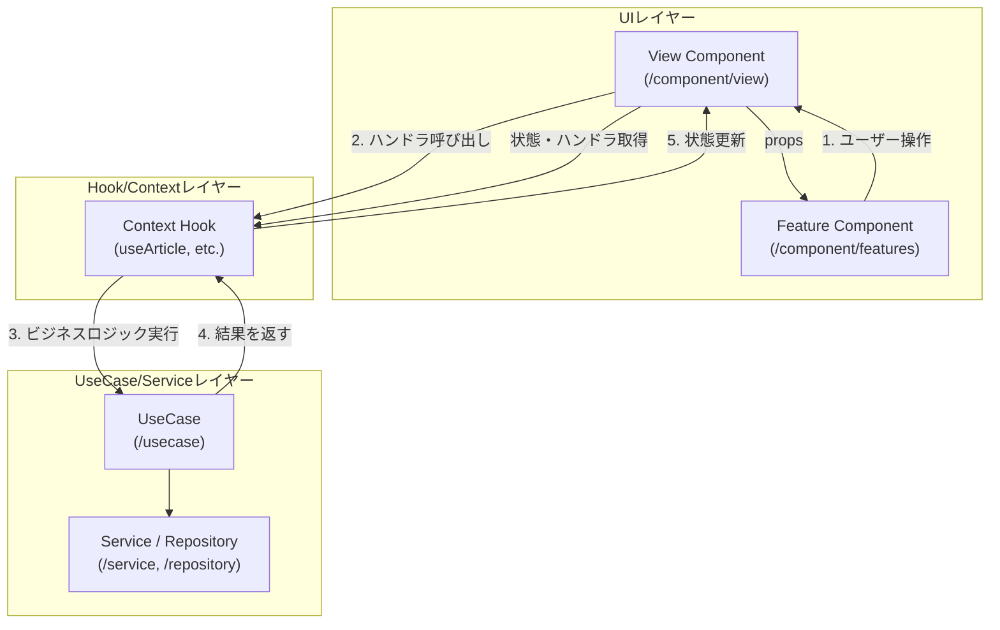

# アーキテクチャ設計書

## 1. 概要

ReactとTypeScriptで構築されたクライアントサイドのシングルページアプリケーション（SPA）です。すべてのデータ永続化にブラウザの`localStorage`を活用しており、完全にオフラインファーストなアプリケーションとなっています。アーキテクチャは、UI、状態管理、およびサービス間の関心事を明確に分離することを中心に、モジュール性、スケーラビリティ、および保守性を考慮して設計されています。

## 2. 技術スタック

-   **フロントエンドフレームワーク:** React 19（関数コンポーネントとフックを使用）
-   **言語:** TypeScript
-   **スタイリング:** Tailwind CSS（CDN経由）
-   **AI連携:** Gemini APIに接続するための`@google/genai` SDK
-   **記事本文抽出:** `@mozilla/readability`
-   **データ永続化:** `localStorage`

## 3. プロジェクト構造

コードベースは、責務に応じて以下の主要なディレクトリに整理されています：

-   `/component`: すべてのReact UIコンポーネントが含まれています。
    -   `/component/view`: 主要なページや機能領域を表すトップレベルのコンテナコンポーネント。レイアウト定義とデータ取得の起点となります。（例: `ArticleAnalysisView.tsx`）
    -   `/component/feature`: 特定の機能（例：記事分析、日次サマリー）に関連する、複数のUIパーツを組み合わせた複合コンポーネントをカプセル化します。（例: `AnalysisResultPanel.tsx`）
    -   `/component/ui`: アプリケーション全体で再利用される、特定のドメインに依存しない汎用的なUIコンポーネント（例: `Loader.tsx`, `MarkdownRenderer.tsx`）を配置します。
        -   `/component/ui/icons`: 再利用可能なSVGアイコンコンポーネントのコレクション。
-   `/context`: React Contextの定義と、それを利用するためのカスタムフック（`useArticle`など）を配置します。グローバルな状態へのアクセスポイントを提供します。
-   `/hook`: 複数のコンポーネントで再利用可能な状態管理ロジックをカプセル化したカスタムフックを配置します。（例: `useArticle.ts`）
-   `/usecase`: アプリケーションのコアなビジネスロジックを実装します。フレームワークに依存しないプレーンなクラスとして定義されます。（今後のリファクタリングで導入予定）
-   `/domain`: 各データモデル（例：`Article`, `Feed`）のコアビジネスロジック、TypeScriptの型定義、およびリポジトリインターフェースを定義します。
-   `/repository`: データアクセス層を実装します。
    -   `/repository/localStorage`: `/domain`で定義されたリポジトリインターフェースの`localStorage`ベースの実装を提供します。
-   `/service`: Gemini APIやCORSプロキシなど、外部APIと対話するモジュールが含まれています。

## 4. アーキテクチャパターン

### 4.1. 状態管理とビジネスロジックの分離

アプリケーションの状態管理とビジネスロジックは、**関心の分離**を徹底するため、以下の階層構造で設計されています。

1.  **UIレイヤー (`/component`):** ユーザーとのインタラクションと情報の表示を担当します。**View/Featureコンポーネントパターン**を採用しています。
    -   **Viewコンポーネント (`/component/view`):** ページレベルのレイアウトを構成します。`Hookレイヤー`から状態とハンドラ関数を取得し、それらを配下の`Featureコンポーネント`に渡すコンテナとしての役割を担います。
    -   **Featureコンポーネント (`/component/features`):** UIのレンダリングに専念するプレゼンテーションコンポーネント。propsで受け取ったデータを表示し、ユーザーイベントをハンドラ関数に伝えます。
2.  **Hookレイヤー (`/hook` & `/context`):** グローバルな状態管理と、ビジネスロジックの呼び出しを担当します。
    -   各ドメイン（`Articles`, `Feeds`など）に対応するカスタムフックとReact Contextで構成されます。
    -   フックは、UIの状態（ローディング状態など）とドメインの状態（記事リストなど）の両方を`useState`等で管理します。
    -   ユーザーのアクションに応じて、`UseCaseレイヤー`（または直接`Serviceレイヤー`）を呼び出し、その結果で状態を更新します。
3.  **UseCaseレイヤー (`/usecase`):** アプリケーションのコアなビジネスロジックをカプセル化します。（今後のリファクタリングで導入）
    -   単一のビジネスプロセス（例：「日次サマリーを生成する」）を実行する責務を持つ、Reactに依存しないクラスです。
4.  **Service/Dataレイヤー (`/service`, `/repository`):** 外部システムとの通信やデータ永続化を担当します。
    -   **Repository:** `localStorage`へのデータの読み書きを抽象化します。
    -   **Service:** 外部API（Gemini API、CORSプロキシ）との通信をカプセル化します。

#### アーキテクチャ図とデータフロー

### 4.2. リポジトリパターンと依存性の注入

アプリケーションは、リポジトリパターンを使用して、データ永続化ロジックをアプリケーションの他の部分から抽象化します。さらに、依存性の注入（DI）パターンを活用して、テスト容易性と柔軟性を高めています。

-   **インターフェース (`/domain/.../repository.ts`):** 各データエンティティに対して、データ操作の契約を規定するインターフェースが定義されます。
-   **実装 (`/repository/localStorage/...`):** 具体的なクラスが、`localStorage`をバックエンドストアとして使用してこれらのインターフェースを実装します。
-   **依存性の注入 (Dependency Injection):**
    -   アプリケーションの起動点である **`index.tsx` (Composition Root)** が、本番用のリポジトリ実装をインスタンス化します。
    -   これらのインスタンスは、`AppProviders`コンポーネントにpropsとして**注入**されます。`AppProviders`は、各Context Providerをセットアップし、その中でカスタムフックが注入されたリポジトリを使用します。
-   **メリット:**
    -   **テストの独立性と信頼性:** テスト時には、本番用のリポジトリの代わりに、テストデータを持つ**インメモリのモックリポジトリ**を`AppProviders`に注入できます。これにより、`localStorage`の状態に依存しない安定したテストが可能です。
    -   **アーキテクチャの柔軟性:** 将来、データ保存先をIndexedDBやFirebaseに変更する場合でも、新しいリポジトリ実装を作成し、`index.tsx`でそれを注入するだけで対応できます。

### 4.3. サービスレイヤー

外部APIとの対話はサービスレイヤーに分離されています。

-   **`geminiService.ts`:** `@google/genai` SDKを使用したGoogle Gemini APIへのすべての呼び出しをカプセル化します。
-   **`rssService.ts` / `articleScraper.ts`:** CORSプロキシ経由での外部リソース（RSSフィード、記事HTML）の取得と解析をカプセル化します。
